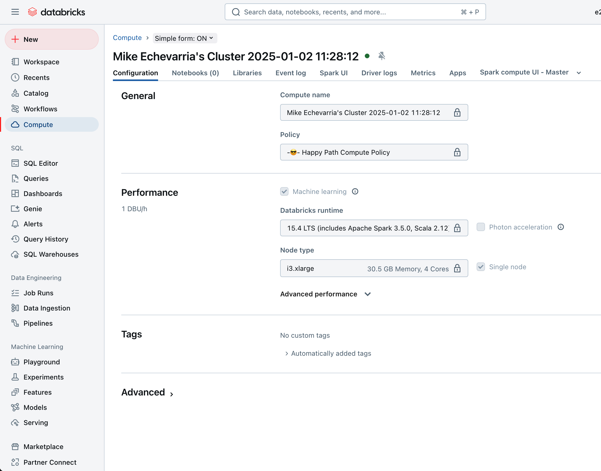
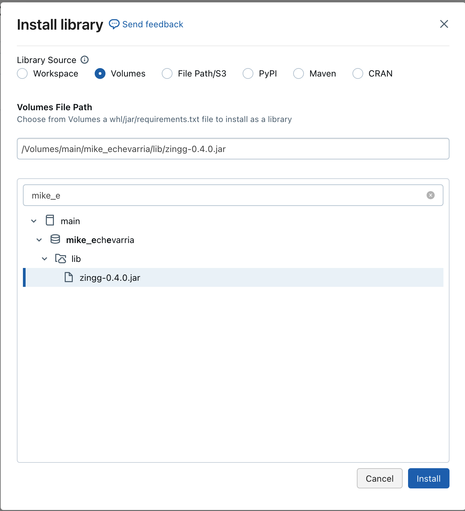

## Databicks Zingg Example

This is a modified example from the [Zingg example notebook](https://github.com/zinggAI/zingg/blob/main/examples/databricks/FebrlExample.ipynb)

Cluster setup 

In addition to the instructions in [Zingg Example](Zingg-Example), the [zingg-0.40.jar](zingg-0.4.0.jar) was uploaded to a volume and then added as a library in the cluster  

